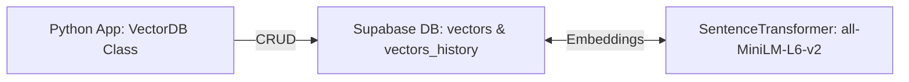

# vectorVault 🗃️

VectorVault is a **Python backend project** for storing and searching **text embeddings** with metadata.  
Built with **Supabase**, **SentenceTransformers**, and **NumPy**, VectorVault demonstrates **ML-powered vector search** with version history tracking.  

---

## 🚀 Project Overview

VectorVault allows you to:

- Store text with metadata and embeddings  
- Perform **semantic search** using cosine similarity  
- Track **version history** for updates  
- Delete entries safely without breaking database constraints  
- Prepare for **Approximate Nearest Neighbor (ANN)** search using FAISS or Annoy  

**Ideal for:**  
- Portfolio projects  
- Learning backend ML systems  
- Experimenting with vector databases and embeddings  

---

## 🧰 Tech Stack

| Component           | Technology / Library                       |
|--------------------|-------------------------------------------|
| Embeddings          | SentenceTransformers (`all-MiniLM-L6-v2`) |
| Database            | Supabase (PostgreSQL + JSONB)             |
| Vector Operations   | NumPy                                      |
| Versioning          | Custom `VectorHistory`                     |

---

## 📦 Installation

```bash
# Clone the repository
git clone https://github.com/yourusername/vectorvault.git
cd vectorvault

# Create virtual environment
python3 -m venv venv
source venv/bin/activate  # Linux/macOS
# venv\Scripts\activate   # Windows

# Install dependencies
pip install -r requirements.txt

```

## 📈 Architecture Diagram


**Flow:**

Add text → encode embedding → store in Supabase
Update → save old version in history → update main vector
Search → fetch vectors → cosine similarity → return top results

## ⚡ Next Features / TODO
- Implement FAISS/Annoy ANN search for faster large-scale queries
- Add batch CSV/JSON import endpoints
- Integrate Supabase Auth for multi-user support
- Advanced metadata filters & tags
- Optional Dockerization for deployment

---

## 📬 Contributing

Contributions are welcome!  
- Feel free to submit **bug reports**, **feature requests**, or **pull requests**.  
- Follow Python best practices and maintain tests.  

---

## 📖 References

- [SentenceTransformers Documentation](https://www.sbert.net/)  
- [Supabase Documentation](https://supabase.com/docs)  
- [NumPy Documentation](https://numpy.org/doc/)

---

## ⭐ Acknowledgements

- Inspired by vector databases, semantic search, and ML-driven backend architectures.  
- Thanks to **Supabase**, **HuggingFace**, and **SentenceTransformers** communities.


